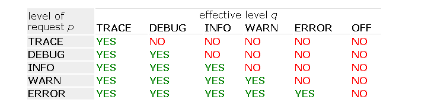

# logback配置

## 配置加载顺序

logback可以通过程序配置，也可以通过xml或者groovy文件配置。如果之前使用log4j.properties配置，可以通过[log4j.properties Translator](https://logback.qos.ch/translator/)转换成logback.xml配置。

配置优先级顺序：

1. 通过SPI机制，从classpath的`META-INF\services\ch.qos.logback.classic.spi.Configurator` （内容为实现类的全限定名）文件中获取`Configurator`的实现。
2. 如果没有自定义`Configurator`，将使用`DefaultJoranConfigurator`作为默认配置类。`DefaultJoranConfigurator` 也需要通过SPI方式提供。
3. 尝试查找classpath下的`logback-test.xml`文件
4. 尝试查找classpath下的`logback.xml`文件
5. 如果以上均未成功，使用`BasicConfigurator` ，将日志输出到控制台。

## 自定义配置文件位置

通过指定系统属性`logback.configurationFile` 的值，可以自定义配置文件的位置。该值可以是一个url，或者是classpath路径下的资源文件，或者是应用的之外的文件。

```bash
java -Dlogback.configurationFile=/path/to/config.xml chapters.configuration.MyApp1
```

当然也可以通过程序指定

```java
import ch.qos.logback.classic.util.ContextInitializer;

public class ServerMain {
    public static void main(String args[]) throws IOException, InterruptedException {
       // must be set before the first call to  LoggerFactory.getLogger();
       // ContextInitializer.CONFIG_FILE_PROPERTY is set to "logback.configurationFile"
       System.setProperty(ContextInitializer.CONFIG_FILE_PROPERTY, "/path/to/config.xml");
       ...
    }
}
```

## 日志等级

`trace`<`debug`<`info`<`warn`<`error`

## 等级继承规则

通常logger都会被分配等级（TRACE, DEBUG, INFO, WARN and ERROR）。如果没有指定，那么会从它最近的父级继承一个指定的等级。

### logger命名的层次结构

一个父级的logger它的name后加上’.’是子logger的name前缀。

## 简单选择规则

一次日志记录请求（通过logger实体调用info，debug等方法）是否有效取决于记录的日志等级是否高于或等于logger的有效等级。因此会有下图所示的结果：



按照文章一开始的xml配置，在`com.nikola` 程序包中增加如下代码。会看到debug和info的日志记录有效，trace无效。

```java
logger.trace("here is trace");
logger.debug("here is debug");
logger.info("here is info");
```

### 

## xml配置方式

logback.xml可以参考如下配置：

```xml
<?xml version="1.0" encoding="UTF-8" ?>
<!DOCTYPE configuration>
<configuration scan="true" scanPeriod="60 seconds" >
    <include resource="org/springframework/boot/logging/logback/defaults.xml"/>

    <property name="LOG_HOME" value="/logs/be-kami/spring-test"/>

    <appender name="STDOUT" class="ch.qos.logback.core.ConsoleAppender">
        <encoder class="ch.qos.logback.classic.encoder.PatternLayoutEncoder">
            <pattern>%clr(%d{yyyy-MM-dd HH:mm:ss.SSS}){yellow} %-5level [%thread] %clr(%logger{15}){blue} - %msg%n</pattern>
        </encoder>
    </appender>

    <appender name="FILE" class="ch.qos.logback.core.rolling.RollingFileAppender">
        <file>${LOG_HOME}/spring-demo.log</file>
        <rollingPolicy class="ch.qos.logback.core.rolling.SizeAndTimeBasedRollingPolicy">
            <!-- rollover daily -->
            <fileNamePattern>${LOG_HOME}/spring-demo-%d{yyyy-MM-dd}.%i.log</fileNamePattern>
            <!-- each file should be at most 100MB, keep 60 days worth of history, but at most 20GB -->
            <maxFileSize>100MB</maxFileSize>
            <maxHistory>60</maxHistory>
            <totalSizeCap>10GB</totalSizeCap>
        </rollingPolicy>
        <encoder class="ch.qos.logback.classic.encoder.PatternLayoutEncoder">
            <pattern>%msg%n</pattern>
        </encoder>
    </appender>

    <root level="info">
        <appender-ref ref="STDOUT"/>
        <appender-ref ref="FILE"/>
    </root>
    <logger name="com.nikola" level="debug" additivity="false">
        <appender-ref ref="STDOUT"/>
        <appender-ref ref="FILE"/>
    </logger>
</configuration>
```

## 配置文件语法

logback不提供像DTD或者schema这样的语法文件规范，官方说配置非常灵活，但实际上很难找到比较全的配置规则。。。配置文件格式如下图所示，最外层为`configuration`标签，内部包含0或多个`appender` 标签，0或多个`logger` 标签，最多一个`root`标签。从0.9.17版本之后，标签不再区分大小写（但是xml标签前后对应的规则还是必须满足的）。


### configuration

| 属性 | 值 | 描述 |
| --- | --- | --- |
| scan | true/false | 是否扫描配置文件变更，扫描周期默认一分钟。 |
| scanPeriod | 单位为：milliseconds, seconds, minutes or hours。 | 配置文件扫描周期
like: 30 seconds |

如果不设置扫描时间单位，则默认使用`milliseconds` 。这种规则通常不合理，因此修改扫描时间切勿忘记时间单位。

使用该属性会启用`ReconfigureOnChangeTask` ，该任务会在单独的线程中运行，检测你的配置文件是否发生变更。如果配置文件包含xml语法错误，会自动回退到上一次没有错误的配置。

| 属性 | 值 | 描述 |
| --- | --- | --- |
| packagingData | true/false | 是否包含包信息 |

当程序出错的时候，启动`packagingData` 会打印报错的堆栈所在的包信息。

### shutdownHook

安装JVM关机钩子是关闭logback和释放相关资源的一种便捷方式。（通过`class` 属性，可以自定义shutdown hook）

`DefaultShutdownHook` 是默认的shutdown hook，停止jvm时在指定的延迟（默认0）之后停止logback上下文。添加shutdown hook，允许后台运行的日志文件压缩任务30秒之内完成。

在web服务中，会自动添加webShutdownHook，不用额外增加`<shutdownHook/>` 。

`LogbackServletContainerInitializer` 是`ServletContainerInitializer` 接口的实现。这个初始化器会依次实例化`LogbackServletContextListener` 。监听器在web应用停止或重启时会停止日志上下文。

通过设置`logbackDisableServletContainerInitializer` 属性值为true，可以停止`LogbackServletContextListener` 的自动装载。该属性也可以通过设置系统属性的方式配置。

```xml
<web-app>
    <context-param>
        <param-name>logbackDisableServletContainerInitializer</param-name>
        <param-value>true</param-value>
    </context-param>
    ....
</web-app>
```

### **contextName**

每个日志配置都有一个对应的上下文名称，该名称可以通`contextName` 标签进行配置。如果不进行配置，默认名称使用`default`。

下面的使用方法，会将上下文名称打印到日志中，用于区分不同的环境。

```xml
<configuration>
  <contextName>myAppName</contextName>
  <appender name="STDOUT" class="ch.qos.logback.core.ConsoleAppender">
    <encoder>
      <pattern>%d %contextName [%t] %level %logger{36} - %msg%n</pattern>
    </encoder>
  </appender>

  <root level="debug">
    <appender-ref ref="STDOUT" />
  </root>
</configuration>
```

### logger配置

logger标签必须含有一个`name`属性，一个可选的`level` 属性，一个可选的`additivity`属性。

| 属性 | 值 | 含义 |
| --- | --- | --- |
| name |  | logger命名，参考命名的层次结构 |
| level | TRACE, DEBUG, INFO, WARN, ERROR, ALL, OFF, INHERITED, NULL （大小写均可） | 当前logger的日志等级 |
| additivity | true/false |  |

日志级别`INHERITED`或其同义词`NULL`，将强制logger的级别从层次结构中更高的地方继承过来。

logger标签包含0个或者多个`appender-ref`标签元素，这样引用的每个appender都会被添加到命名的logger中。注意，与log4j不同的是，logback-classic在配置一个给定的logger时，不会关闭或删除任何先前引用的appender。

### root标签配置

root只有一个`level`属性，并且该属性值不能为`INHERITED`，`NULL` 。

和logger一样root也包含0或多个`appender-ref` 子元素标签。

### appender配置

包含两个必须的属性`name`，`class`。name属性特指appender的名称，而class属性特指appender类的全限定名，用于实例化该类。

appender包含最多一个layout标签，0或多个encoder，filter标签


`layout`标签含有一个`class`必填属性，值为类的全限定名。layout可以含有其他元素，在layout类的实例化时作为属性填充。如果使用`PatternLayout` 那么属性可以通过默认映射进行指定，因此可以不用进行配置。

`encoder` 标签也含有一个`class`必填属性，值为类的全限定名。encoder也可以含有其他元素，在encoder类的实例化时作为属性填充。如果使用`PatternLayoutEncoder`那么属性可以通过默认映射进行指定，因此可以不用进行配置。

日志记录到多个appender很容易实现，直接定义多个appender，然后将他们指定到对应的logger就可以。

```xml
<configuration>

  <appender name="FILE" class="ch.qos.logback.core.FileAppender">
    <file>myApp.log</file>

    <encoder>
      <pattern>%date %level [%thread] %logger{10} [%file:%line] %msg%n</pattern>
    </encoder>
  </appender>

  <appender name="STDOUT" class="ch.qos.logback.core.ConsoleAppender">
    <encoder>
      <pattern>%msg%n</pattern>
    </encoder>
  </appender>

  <root level="debug">
    <appender-ref ref="FILE" />
    <appender-ref ref="STDOUT" />
  </root>
</configuration>
```

此处定义了`FILE`和`STDOUT` ，并将他们指定给`root` 。FILE将日志输出到myApp.log文件中，STDOUT会在控制台打印出日志。

### 默认类映射

在logback-classic模块中，有一些内部规则，将父类和属性名映射到默认的类。


以上映射规则可能发生改变，具体查看代码[JoranConfigurator (qos.ch)](https://logback.qos.ch/xref/ch/qos/logback/classic/joran/JoranConfigurator.html)中的`addDefaultNestedComponentRegistryRules` 方法。最终可以找到如下代码。


### appender的累加性

默认情况下，appender是叠加的。如果logger和它的父级logger同时使用相同的appender，那么打印的日志将会出现重复。

如下代码在打印`chapters.configuration` 包下的日志时将会出现重复。

```xml
<configuration>

  <appender name="STDOUT" class="ch.qos.logback.core.ConsoleAppender">
    <encoder>
      <pattern>%d{HH:mm:ss.SSS} [%thread] %-5level %logger{36} - %msg%n</pattern>
    </encoder>
  </appender>

  <logger name="chapters.configuration">
    <appender-ref ref="STDOUT" />
  </logger>

  <root level="debug">
    <appender-ref ref="STDOUT" />
  </root>
</configuration>
```

一般情况下，我们希望通过appender，将日志打印到不同的地方。参考如下配置：

```xml
<configuration>

  <appender name="FILE" class="ch.qos.logback.core.FileAppender">
    <file>myApp.log</file>
    <encoder>
      <pattern>%date %level [%thread] %logger{10} [%file:%line] %msg%n</pattern>
    </encoder>
  </appender>

  <appender name="STDOUT" class="ch.qos.logback.core.ConsoleAppender">
    <encoder>
      <pattern>%msg%n</pattern>
    </encoder>
  </appender>

  <logger name="chapters.configuration">
    <appender-ref ref="FILE" />
  </logger>

  <root level="debug">
    <appender-ref ref="STDOUT" />
  </root>
</configuration>
```

所有的日志通过控制台打印，`chapters.configuration` 下的日志将会额外打印到文件中。

通过设置`logger`标签的`additivity`属性为false可以禁止日志叠加。使用该属性，相应日志会通过logger自己的appender输出，即使存在父级logger也不会使用父级的appender输出日志。

```xml
<configuration>

  <appender name="FILE" class="ch.qos.logback.core.FileAppender">
    <file>foo.log</file>
    <encoder>
      <pattern>%date %level [%thread] %logger{10} [%file : %line] %msg%n</pattern>
    </encoder>
  </appender>

  <appender name="STDOUT" class="ch.qos.logback.core.ConsoleAppender">
    <encoder>
      <pattern>%msg%n</pattern>
    </encoder>
  </appender>

  <logger name="chapters.configuration.Foo" additivity="false">
    <appender-ref ref="FILE" />
  </logger>

  <root level="debug">
    <appender-ref ref="STDOUT" />
  </root>
</configuration>
```

按照如上配置`chapters.configuration.Foo` 中的日志将不会打印到控制台，即使存在root配置。

如果我们希望它输出到控制台，只需要在其下添加`STDOUT` 即可。

### 文件引入

Joran支持从其他文件中引入部分配置。通过`include`标签实现。

include的值可以是文件，资源或者是url。

1. 引用文件，使用file属性
    
    ```xml
    <configuration>
      <include file="src/main/java/chapters/configuration/includedConfig.xml"/>
    
      <root level="DEBUG">
        <appender-ref ref="includedConsole" />
      </root>
    
    </configuration>
    ```
    
2. 引用资源，使用resource属性
    
    ```xml
    <include resource="includedConfig.xml"/>
    ```
    
3. 引用url，使用url属性
    
    ```xml
    <include url="http://some.host.com/includedConfig.xml"/>
    ```
    

如果无法找到需要引用的文件，logback会打印异常信息，将`optional` 属性设置为true可以避免警告。

目标文件必须将它的标签嵌套在`included`标签中。

```xml
<included>
  <appender name="includedConsole" class="ch.qos.logback.core.ConsoleAppender">
    <encoder>
      <pattern>"%d - %m%n"</pattern>
    </encoder>
  </appender>
</included>
```

### 上下文监听器

`[LoggerContextListener](https://logback.qos.ch/xref/ch/qos/logback/classic/spi/LoggerContextListener.html#LoggerContextListener)` 接口的实现会监听logger上下文生命周期的各种事件。``

1. JMXConfigurator
    
    允许通过JMX进行配置logback。
    
    ```xml
    <configuration>
      <jmxConfigurator />
    </configuration>
    ```
    
2. LevelChangePropagator
    
    可以将任何logback-classic日志记录器的级别变化传播到java.util.logging框架中(?)
    
    [Chapter 3: Configuration (qos.ch)](https://logback.qos.ch/manual/configuration.html#LevelChangePropagator)
    
    ```xml
    <configuration debug="true">
      <contextListener class="ch.qos.logback.classic.jul.LevelChangePropagator"/>
       <!-- rest of the configuration file .... -->
    </configuration>
    ```
    
3. SequenceNumberGenerator
    
    Logback支持一个序列号字段，在事件创建时自动填充。这个字段是由连接到日志上下文的序列号生成器提供的。
    
    ```xml
    <configuration>
        <sequenceNumberGenerator class="ch.qos.logback.core.spi.BasicSequenceNumberGenerator"/>
    
         <!-- rest of the configuration file .... -->
    </configuration>
    ```