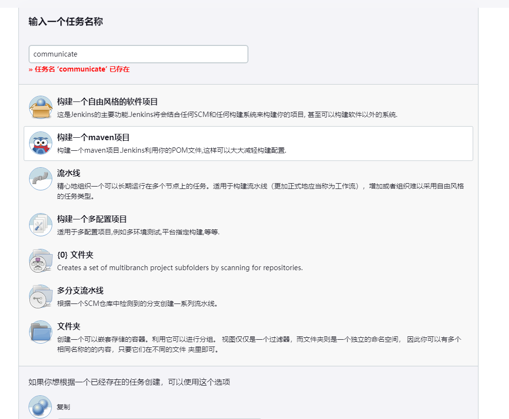
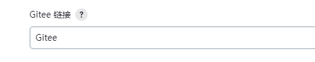
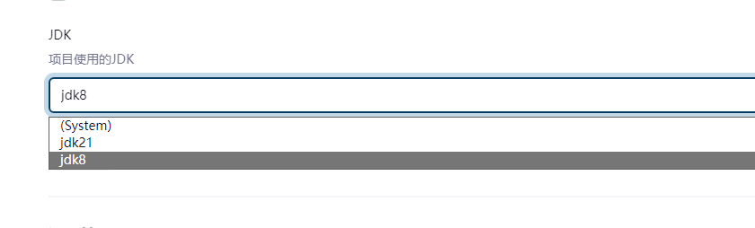
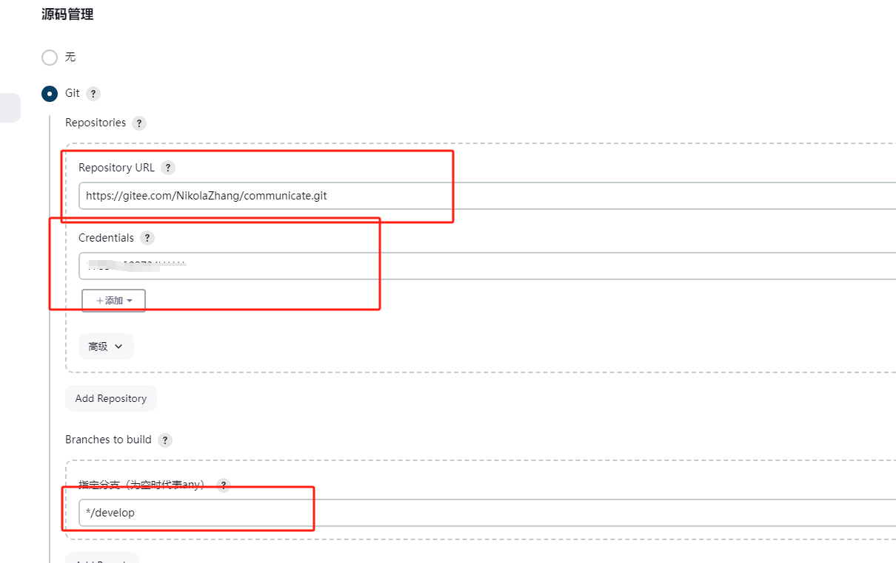
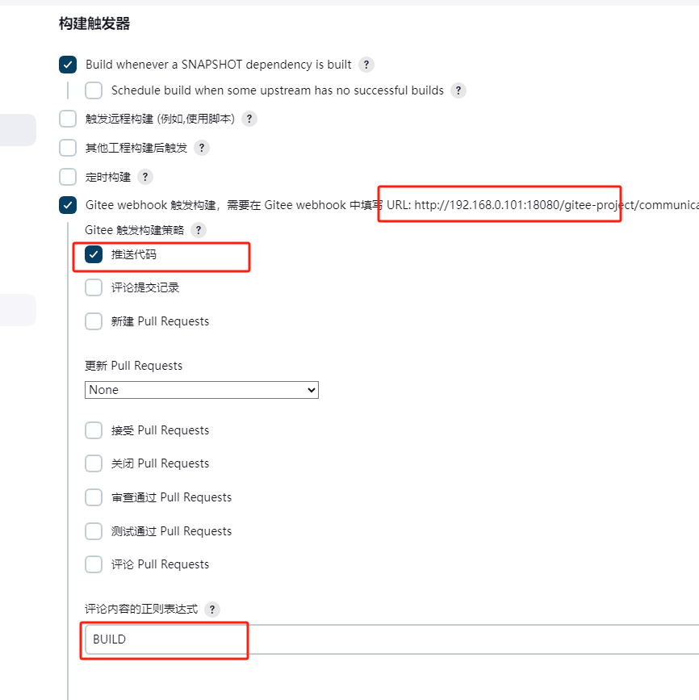
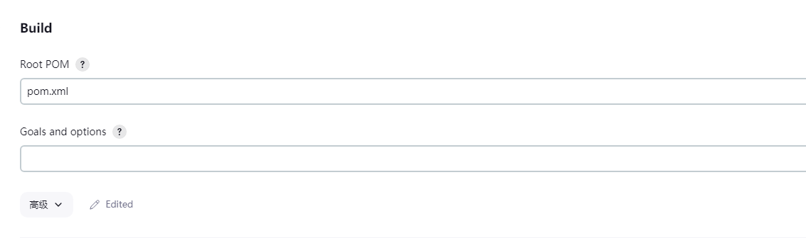
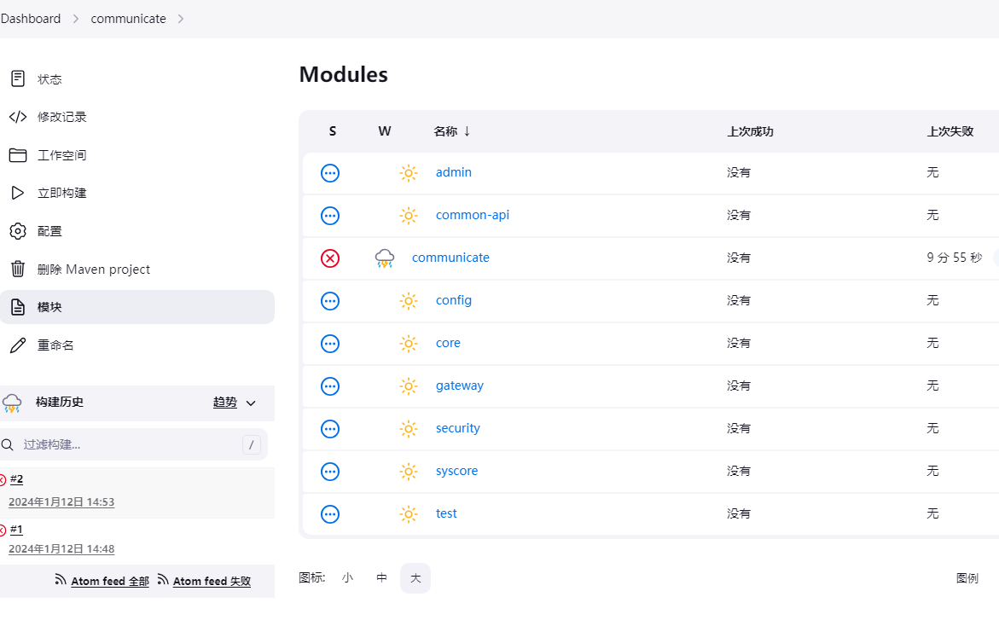

## 选择构建方式

这里使用maven的构建方式，如果没有这个选项，需要先安装`Maven Integration plugin`插件，并配置maven。

## 构建配置

1. Gitee 链接  
    该配置对应`系统管理-系统配置`中的`Gitee 配置`

    

2. jdk  
   该配置对应`系统管理-全局工具配置`中的`JDK 安装`，可以配置多个jdk，选用项目中需要的即可。

    

3. 源码管理  
   这个地方配置项目的源码位置，构建使用的分支，以及访问需要的账号和密码。账号密码可以在`系统管理-凭据`中提前配置。

    

4. 构建触发器

   这里我们配置，触发构建的情形，我们通过推送代码中的message中的关键词来触发。如下，当提交信息中含有`BUILD`时就会触发构建。

    

5. BUILD

   这里配置pom.xml的相对路径。

    

暂时就这样配置，之后会在构建后增加一些脚本用于项目的部署。

多模块的maven项目配置之后不能立即看到项目中的所有模块，需要构建之后才可以看到。

