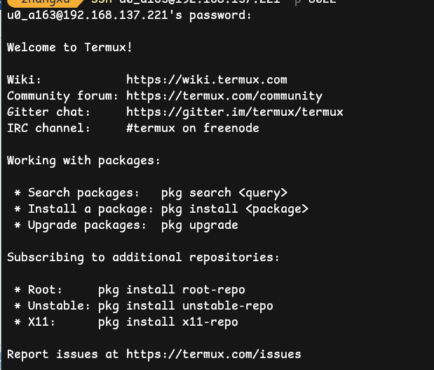

> Termux 是一款安卓终端模拟器和Linux环境应用程序，可直接运行，无需root或设置。系统会自动安装最低限度的基础系统--其他软件包可通过APT软件包管理器获取。

## termux安装及配置

### 安装包获取

可以通过获取最新的发布版本。

### 软件包镜像源切换

输入`pkg upgrade`，默认的官方镜像有些无法访问，提示404。此时可以选择切换镜像源，输入命令`termux-change-repo`。
此时会打开一个图形界面。


第一个我们选China；第二个选择清华大学镜像源（tuna），点击确定。推荐使用第一种。

p.s.：之前也见过列出三个库的界面，每一个都选择tuna即可。

### 安装ssh

在手机上输入命令实在不太方便，可以安装ssh，通过远程操作。

输入命令：

```bash
pkg install openssh
```

```bash
# 启动ssh
sshd
```

```bash
# 查看当前用户
whoami
```

```bash
# 查看ip
ifconfig
```

```bash
# 设置密码
passwd
```

### 访问

打开终端，输入：

```bash
ssh username@ip -p 8022
```

`username`为`whoami`的输出，`ip`为`ifconfig`的输出。
端口为8022是固定的。

输入密码后就可以访问了。


