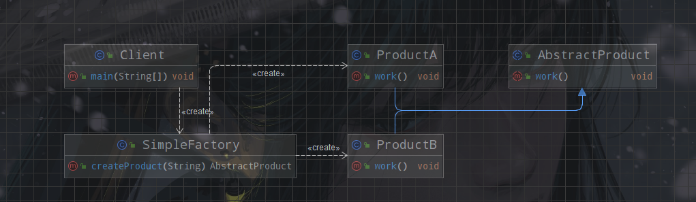

> 简单工厂模式是由一个工厂对象决定创建出哪一种产品类的实例。又称为静态工厂模式。简单工厂模式是工厂模式家族中最简单实用的。



简单工厂模式包含以下主要角色:

- 工厂类（SimpleFactory）: 这个类包含创建所有产品的逻辑。。
- 抽象产品类（AbstractProduct）：定义某类产品的属性和行为。
- 产品类(Product)：抽象产品类的实现，定义具体产品的属性和行为。

## 代码实现

### 工厂类

```java
public class SimpleFactory {

    public static AbstractProduct createProduct(String name) {
        return switch (name) {
            case "A" -> new ProductA();
            case "B" -> new ProductB();
            default -> throw new IllegalArgumentException("Invalid product name");
        };
    }
}


```

该类通过输入相应的指令，可以创建对应的对象（产品类），产品类需要为`AbstractProduct`的子类。

### 抽象产品类

```java
public abstract class AbstractProduct {
    public abstract void work();
}

```

定义抽象类`AbstractProduct`，并定义产品的通用行为`work()`。

### 具体产品类

```java
public class ProductA extends AbstractProduct {
    @Override
    public void work() {
        System.out.println("ProductA work");
    }
}

```

### 开始生产

下面我们调用工厂进行生产，并使用产品进行工作。

```java
public class Client {

    public static void main(String[] args) {
        AbstractProduct productA = SimpleFactory.createProduct("A");
        productA.work();
        AbstractProduct productB = SimpleFactory.createProduct("B");
        productB.work();
    }
}

```

## 总结

简单工厂模式的主要优点:

- 封装了对象创建逻辑,将产品类与客户端分离,提高了系统的灵活性。
- 便于扩展新的产品类,客户端无需修改代码,只需要添加新的工厂方法即可。
- 客户端无需知道所创建的具体产品类,只需要知道参数即可获取产品实例。

主要缺点是工厂类职责过重,所有产品创建逻辑都在一个类中,不利于系统维护。
