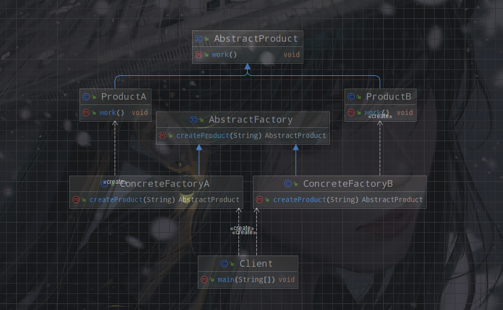

> 工厂方法模式(Factory Method Pattern)去掉了简单工厂模式中工厂方法的静态属性，使得它可以被子类继承。这样在简单工厂模式里集中在工厂方法上的压力可以由工厂方法模式里不同的工厂子类来分担。



主要角色包括:

- 抽象工厂(AbstractFactory)：提供了创建产品的接口，调用者通过这个接口来创建产品。
- 具体工厂(ConcreteFactory)：实现了抽象工厂中的抽象方法，完成真正的产品实例化。
- 抽象产品(AbstractProduct)：定义了产品的规范，描述了产品的主要特性和功能。
- 具体产品(ConcreteProduct)：实现了抽象产品角色所定义的接口，由具体工厂来创建,它同具体工厂之间一一对应。


## 代码实现

### 抽象工厂与具体工厂

```java
public abstract class AbstractFactory {
    public abstract AbstractProduct createProduct(String name);
}

```

具体工厂继承`AbstractFactory`，并实现`createProduct`方法。

```java
public class ConcreteFactoryA extends AbstractFactory {

    @Override
    public AbstractProduct createProduct(String name) {
        return new ProductA();
    }
}

```

同样你可以创建一个具体工厂`ConcreteFactoryB`用于生产`ProductB`。

### 抽象产品与具体产品

```java
public abstract class AbstractProduct {
    public abstract void work();
}
```

具体产品继承`AbstractProduct`，并实现`work`方法。

```java
public class ProductA extends AbstractProduct {
    @Override
    public void work() {
        System.out.println("ProductA work");
    }
}
```

同样你可以创建一个具体产品`ProductB`来实现`AbstractProduct`接口。

### 开始生产

```java
public class Client {

    public static void main(String[] args) {
        AbstractFactory factoryA = new ConcreteFactoryA();
        AbstractProduct productA = factoryA.createProduct("A");
        productA.work();

        AbstractFactory factoryB = new ConcreteFactoryB();
        AbstractProduct productB = factoryB.createProduct("B");
        productB.work();
    }
}


```

通过指定不同的具体工厂我们可以实现不同种类产品的创建。
