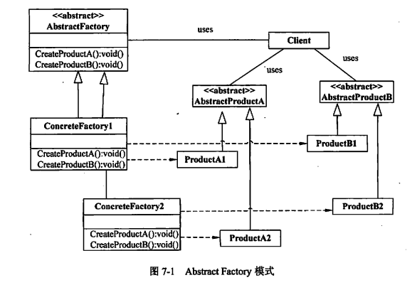
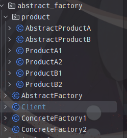

> 抽象工厂模式（Abstract Factory Pattern）是围绕一个超级工厂创建其他工厂。该超级工厂又称为其他工厂的工厂。这种类型的设计模式属于创建型模式，它提供了一种创建对象的最佳方式。  
> 在抽象工厂模式中，接口是负责创建一个相关对象的工厂，不需要显式指定它们的类。每个生成的工厂都能按照工厂模式提供对象。  
> 抽象工厂模式提供了一种创建一系列相关或相互依赖对象的接口，而无需指定具体实现类。通过使用抽象工厂模式，可以将客户端与具体产品的创建过程解耦，使得客户端可以通过工厂接口来创建一族产品。



图中的抽象类abstract，可以换成接口interface。

从图中可以看到，该模式主要包含以下角色：

1. 抽象工厂（Abstract Factory）：声明了一组用于创建产品对象的方法，每个方法对应一种产品类型。抽象工厂可以是接口或抽象类。
2. 具体工厂（Concrete Factory）：实现了抽象工厂接口，负责创建具体产品对象的实例。
3. 抽象产品（Abstract Product）：定义了一组产品对象的共同接口或抽象类，描述了产品对象的公共方法。
4. 具体产品（Concrete Product）：实现了抽象产品接口，定义了具体产品的特定行为和属性。

## 使用场景

1. 系统独立于产品的创建、组成及表示。
2. 系统配置成具有多个产品的系列，产品之间可以没有关联。
3. 相关产品对象系列是共同使用的。这是抽象工厂的关键，否则可以使用工厂方法模式。
4. 期望提供产品的类库，只开放其接口，而不是其实现。

<!--more-->

## 代码实现

### 代码结构



### 抽象工厂

首先定义一个抽象工厂，定义工厂的生产任务。如下，我们的要求工厂可以生产A、B两种产品大类（产品族）。

```java
public abstract class AbstractFactory {

    public abstract AbstractProductA createProductA();
    public abstract AbstractProductB createProductB();
}

```

### 抽象产品与具体产品

AbstractProductA, AbstractProductB是抽象产品，或者称为产品族。他们定义了子产品的应该具有的属性及行为。

```java
public abstract class AbstractProductA {
    public abstract void work();
}

```

AbstractProductB定义类似AbstractProductA。

通过继承抽象产品，我们可以定义具体产品的特性。

```java
public class ProductA1 extends AbstractProductA {

    @Override
    public void work() {
        System.out.println("ProductA1 do something");
    }
}
```

之后我们可以创建ProductA2，ProductB1，ProductB2这样的产品。以表现产品的多样。

### 具体工厂

有了抽象工厂作为生产产品的要求，我们通过定义具体的工厂来实现这个目标。  
考虑到环境的限制，我们往往需要多个工厂来生产不同的产品，以完成所有产品的生产任务。

```java
public class ConcreteFactory1 extends AbstractFactory {
    @Override
    public AbstractProductA createProductA() {
        return new ProductA1();
    }

    @Override
    public AbstractProductB createProductB() {
        return new ProductB1();
    }
}
```

ConcreteFactory1只生产ProductA1，ProductB1。类似的我们定义ConcreteFactory2来生产ProductA2，ProductB2。

### 开始生产

我们创建一个终端，来发送生产指令。

```java
public class Client {

    public static void main(String[] args) {
        AbstractFactory factory1 = produce("factory1");
        AbstractProductA productA1 = factory1.createProductA();
        AbstractProductB productB1 = factory1.createProductB();
        productA1.work();
        productB1.work();

        AbstractFactory factory2 = produce("factory2");
        AbstractProductA productA2 = factory2.createProductA();
        AbstractProductB productB2 = factory2.createProductB();
        productA2.work();
        productB2.work();

    }

    public static AbstractFactory produce(String type) {
        return switch (type) {
            case "factory1" -> new ConcreteFactory1();
            case "factory2" -> new ConcreteFactory2();
            default -> new ConcreteFactory1();
        };
    }
}

```

这里的`produce`方法也是一个工厂方法，用于指定具体工厂。

运行结果如下：

```bash
ProductA1 do something
ProductB1 do something
ProductA2 do something
ProductB2 do something
```

### 改进

上面要想生产一个产品必须指定一个具体工厂名称。有一天新厂长来了，他不知道哪个厂生产哪个产品。根据产品来找到工厂进行生产似乎更加方便。

我们将Client调整一下，`produce`方法通过指定产品就能找到对应的工厂，进行生产了。

```java
public class Client {

    public static void main(String[] args) {
        AbstractFactory factory1 = produce(ProductA1.class);
        AbstractProductA productA1 = factory1.createProductA();
        productA1.work();

        AbstractFactory factory2 = produce(ProductB2.class);
        AbstractProductB productB2 = factory2.createProductB();
        productB2.work();

    }

    public static AbstractFactory produce(Class<?> type) {
        if (type == ProductA1.class || type == ProductB1.class) {
            return new ConcreteFactory1();
        }
        if (type == ProductA2.class || type == ProductB2.class) {
            return new ConcreteFactory2();
        }

        return new ConcreteFactory1();
    }
}
```

## 对比工厂方法模式

工厂方法模式面向的是一个产品等级结构，每一个具体工厂创建一个产品对象。抽象工厂模式面向的时多个产品等级结构，每一个具体工厂创建一组产品对象。

当我们需要新增一个产品时，工厂方法模式需要创建一个新的工厂类；抽象工厂模式，需要在原来的抽象工厂中新增一个创建产品的方法。
