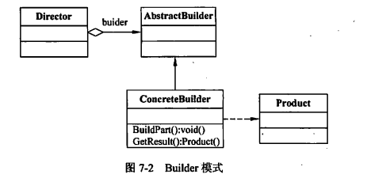

> 建造者模式将复杂对象的构建与其表示相分离，这样相同的构造过程可以创建不同的对象。
> 通过只指定对象的类型和内容，建造者模式允许客户端对象构建一个复杂对象。客户端可以不受该对象构造细节的影响。这样通过定义一个能够构建其他类实例的类，就可以简化复杂对象的创建过程。
> 建造者模式生产一个主要产品，而该产品中可能有多个类，但是通常只有一个主类。当使用该模式的时候，可以一次创建所有的复杂对象。而其他模式一次就只能创建一个对象。

建造者模式包含以下角色：

- AbstractBuilder：抽象建造者  
    这个角色用于规范产品对象的各个组成成分的建造。
- ConcreteBuilder：具体建造者  
    在指导者的调用下创建产品实例。
- Director：指挥者
    调用具体建造者角色创建产品对象。
- Product：产品角色

## 代码实现

