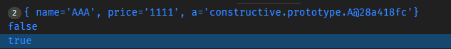
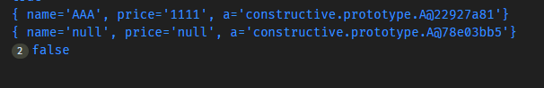
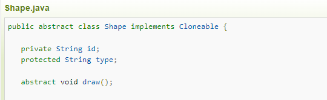
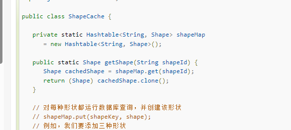

> `Prototype`模式允许对象在不了解要创建对象的确切类以及如何创建等细节的情况下创建自定义对象。使用`Prototype`实例，便指定了要创建的对象类型，而通过复制这个`Prototype`，就可以创建新的对象。  
> `Prototype`模式是通过先给出一个对象的`Prototype`对象，然后再初始化对象的创建。创建初始化后的对象再通过`Prototype`对象对其自身进行复制来创建其他对象。`Prototype`模式使得动态创建对象更加简单，只要将对象类定义能够复制自身就可以实现。

## 基于Cloneable接口的代码实现

### 定义抽象类

```java

public abstract class Prototype {

    private String name;
    private String price;
    private A a = new A("a");

    public Prototype() {
    }

    public Prototype(String name, String price) {
        this.name = name;
        this.price = price;
    }

    /**
     * 自定义的复制方法
     */
    public abstract Prototype cloneObject();

    public String getName() {
        return this.name;
    }

    public void setName(String name) {
        this.name = name;
    }

    public String getPrice() {
        return this.price;
    }

    public A getA() {
        return this.a;
    }

    public void setA(A a) {
        this.a = a;
    }

    public void setPrice(String price) {
        this.price = price;
    }

    @Override
    public String toString() {
        return "{" +
            " name='" + getName() + "'" +
            ", price='" + getPrice() + "'" +
            ", a='" + getA() + "'" +
            "}";
    }


}

class A {
    private String name;


    public A(String name) {
        this.name = name;
    }


    public String getName() {
        return this.name;
    }

    public void setName(String name) {
        this.name = name;
    }

}

```

### 定义子类

`ConcretePrototype1`实现了`Cloneable`接口，并重写了`clone`方法，实现了对象的复制。

```java
public class ConcretePrototype1 extends Prototype implements Cloneable {


    public ConcretePrototype1(String name, String price) {
        super(name, price);
    }


    @Override
    public Object clone() {
        try {
            return super.clone();
        } catch (CloneNotSupportedException e) {
            e.printStackTrace();
            return null;
        }
    }


    @Override
    public Prototype cloneObject() {
        throw new UnsupportedOperationException("Unimplemented method 'clone'");
    }

}
```

### 测试

```java
public class PrototypeClient {
    public static void main(String[] args) {
        // 浅拷贝 Nikola Zhang  【2018/12/14 0014 20:51】
        ConcretePrototype1 prototype1 = new ConcretePrototype1("AAA", "1111");
        ConcretePrototype1 prototype1Copy = (ConcretePrototype1) prototype1.clone();

        System.out.println(prototype1);
        System.out.println(prototype1Copy);
        System.out.println(prototype1 == prototype1Copy);
        System.out.println(prototype1.getA() == prototype1Copy.getA());
  }
}


```

### 结果



根据结果截图，可以看到引用类型对象输出的内容是相同的，但是地址是不同的。但内部的引用类型A地址确实相同的。该方式实现了浅拷贝的方式。
这就引出了一个额外的话题，深拷贝。深拷贝可以通过实现`Cloneable`接口实现，也可以通过实现`Serializable`接口实现。

## 基于Serializable接口的深拷贝

需要注意的是，`ConcretePrototype2`中的引用类型必须实现`Serializable`接口，否则会报错。

```java
public class ConcretePrototype2 extends Prototype implements Serializable {


    public ConcretePrototype2() {
        super();
    }


    public ConcretePrototype2(String name, String price) {
        super(name, price);
    }

    @Override
    public Prototype cloneObject() {
        ByteArrayOutputStream bos = new ByteArrayOutputStream();
        try (ObjectOutputStream oos = new ObjectOutputStream(bos)) {
            oos.writeObject(this);
            oos.flush();
        } catch (IOException e) {
            e.printStackTrace();
            return null;
        }
        // 从字节流中读取对象
        ByteArrayInputStream bis = new ByteArrayInputStream(bos.toByteArray());
        try (ObjectInputStream ois = new ObjectInputStream(bis)) {
            return (Prototype) ois.readObject();
        } catch (ClassNotFoundException | IOException e) {
            e.printStackTrace();
            return null;
        }
    }

}

```

### 测试深拷贝

```java
public class PrototypeClient {
    public static void main(String[] args) {
        ConcretePrototype2 prototype2 = new ConcretePrototype2("AAA", "1111");
        ConcretePrototype2 prototype2Copy = (ConcretePrototype2) prototype2.cloneObject();

        System.out.println(prototype2);
        System.out.println(prototype2Copy);
        System.out.println(prototype2 == prototype2Copy);
        System.out.println(prototype2.getA() == prototype2Copy.getA());
  }
}

```

### 深拷贝结果



可以看到两个对象的引用地址是不同的，并且内部的引用类型A地址是不同的。

## 其他

我还看过一个使用缓存的例子，[菜鸟教程-原型模式](https://www.runoob.com/design-pattern/prototype-pattern.html)。

在这个例子中，实际获取对象的时候也是使用了浅拷贝。

`Cloneable`接口实现。



从缓存中获取对象并拷贝。


