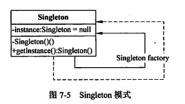

> 单例模式，确保一个类只有一个实例，并且提供了对该类的全局访问入口，它可以确保使用这个类实例的所有对象都使用相同的实例。



## 单例模式-懒汉模式

在需要的时候才创建实例，并且只创建一次。

```java
public class SingletonA {
    private static SingletonA instance = null;


    public SingletonA() {
    }

    public static SingletonA getInstance() {
        if(instance == null){
            instance = new SingletonA();
        }
        return instance;
    }

}

```

## 单例模式-饿汉模式

在类加载的时候就创建实例。

```java
public class SingletonB {
    private final static SingletonB instance = new SingletonB();

    public static SingletonB getInstance() {
        return instance;
    }

}

```

## 测试

执行`main`方法，结果输出均为`true`。

```java
public class Client {

    public static void main(String[] args) {
        AbstractProduct productA = SimpleFactory.createProduct("A");
        productA.work();
        AbstractProduct productB = SimpleFactory.createProduct("B");
        productB.work();
    }
}

```

## 改进

如果考虑并发的情形，上面的懒汉模式会创建多个实例，因此需要加锁。

```java

public class SyncSingletonA {
    private static volatile SyncSingletonA instance = null;

    public SyncSingletonA() {
    }

    public static SyncSingletonA getInstance() {
        if (instance == null) {
            synchronized (SyncSingletonA.class) {
                if (instance == null) {
                    instance = new SyncSingletonA();
                }
            }
        }
        return instance;
    }

}


```

加锁之后，还要进行判空，目的是为了防止其他线程创建类实例后，当前线程又再次创建。
