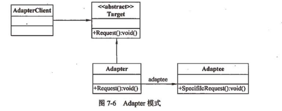

> `Adapter`，可以充当两个类之间的媒介，它可以转换一个类的接口，这样就可以被另外一个类使用，这使得具有不兼容接口的类能够协同使用。  
> `Adapter`模式实现为客户端所知的接口，并且为客户端提供对不为其所知的类实例的访问。`Adapter`对象可以在不知道实现该接口的类的情况下，提供该接口的功能。



适配器模式允许两个或多个不兼容的对象进行交互通信，提高已有功能的重复使用性。

以下几种情况应该使用适配器模式。

1. 要使用已有类，而该类接口与所需的接口并不匹配。
2. 要创建可重用的类，该类可以与不相关的未知类进行协作，也就是说，类之间并不需要兼容接口。
3. 要在一个不同于已知对象接口的接口环境中使用对象。
4. 必须要进行多个源之间的接口转换的时候。

## 代码实现

### 已有类的实现

假设系统中已经存在了`Adaptee`类，并且该类实现了某种功能，或者具有某些我们需要的属性。

```java
public class Adaptee {

    public void specificRequest() {
        System.out.println("Specific request");
    }

}
```

### 目标类的接口

现在需要新增一个接口以及该接口对应的功能，如下。

```java
public abstract class Target {
    
    public abstract void request();

}

```

### 适配器

我们需要一个适配器类，该类实现了目标类的接口，并且将`Adaptee`类中的方法进行适配，如下。

```java
public class Adapter extends Target {
    
    private Adaptee adaptee;
    
    @Override
    public void request() {
        adaptee = new Adaptee();
        adaptee.specificRequest();
    }

}
```

### 使用

```java
public class AdapterClient {
    
    public static void main(String[] args) {
        Target target = new Adapter();
        target.request();
        
    }
}
```
