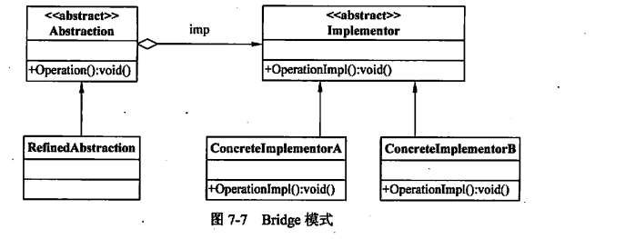

> 桥接模式通过抽象和实现部分的分离，使得两者可以独立变化。抽象部分定义抽象类，维护一个对实现对象的引用。
> 实现部分定义实现接口，提供不同的实现。这样就可以通过组合不同的抽象类和实现类来创建对象，提高了系统的灵活性。



主要角色：

- 抽象（Abstraction）：定义抽象接口，通常包含对实现接口的引用。
- 扩展抽象（RefinedAbstraction）：对抽象的扩展，可以是抽象类的子类或具体实现类。
- 抽象实现（Implementor）：定义实现接口，提供基本操作的接口。
- 具体实现（ConcreteImplementor）：实现实现接口的具体类。

::: info
在设计模式中类与类之间的关系主要有6种：依赖、关联、聚合、组合、继承、实现，它们之间的耦合度依次增加。子类必须实现抽象父类中的所有方法，父类抽象方法的变更，必然导致子类的变更。这是一种强关联关系。强关联有必然使我们的系统不易扩展。所以桥梁模式为化解强关联提供了一种解决方案。

桥接模式，抽象和实现的分离，可以理解为功能性的抽象和内部实现的分离。

当组件比较复杂，比如：属性存在复杂的依赖关系时，可以通过桥接模式进行拆分成多个组件。使得每个组件可以单独扩展，以此来简化组件，实现解耦。
:::

## 代码实现

### 抽象

```java
interface Implementor {
    public void operationImpl();

}
```

### 扩展抽象

```java
public class ConcreteImplementorA implements Implementor {

    @Override
    public void operationImpl() {
        System.out.println("ConcreteImplementorA operation");
    }
}
```

### 抽象实现

```java
public abstract class Abstraction {
    protected Implementor impl;

    public void setImplementor(Implementor impl) {
        this.impl = impl;
    }

    abstract public void operation();

}
```

这里聚合了`Implementor`，通过该类来实现我们的具体功能。

### 具体实现

```java
public class RefinedAbstraction extends Abstraction {

    public void operation() {
        // do something
        impl.operationImpl();
    }
}


```

在抽象功能的实现类中，调用内部实现方法，完成`operation`的操作。

### 使用

```java
public class Client {
    
    public static void main(String[] args) {
        Abstraction abstraction = new RefinedAbstraction();
        abstraction.setImplementor(new ConcreteImplementorA());
        abstraction.operation();

    }
}
```

`Abstraction`和`Implementor`是`Bridge模式`中定义的两个抽象/接口,用于解耦抽象部分和实现部分。

为了保证原有组件的功能，在`Abstraction`中聚合`Implementor`，除了实现`Abstraction`自身的功能，通过调用`Implementor`的方法来完成其他功能。

这样`Abstraction`和`Implementor`可以独立变化，提高了系统的灵活性。
