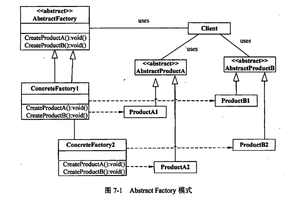

> 抽象工厂模式（Abstract Factory Pattern）是围绕一个超级工厂创建其他工厂。该超级工厂又称为其他工厂的工厂。这种类型的设计模式属于创建型模式，它提供了一种创建对象的最佳方式。  
> 在抽象工厂模式中，接口是负责创建一个相关对象的工厂，不需要显式指定它们的类。每个生成的工厂都能按照工厂模式提供对象。  
> 抽象工厂模式提供了一种创建一系列相关或相互依赖对象的接口，而无需指定具体实现类。通过使用抽象工厂模式，可以将客户端与具体产品的创建过程解耦，使得客户端可以通过工厂接口来创建一族产品。

图中的抽象类abstract，可以换成接口interface。

## 使用场景

1. 系统独立于产品的创建、组成及表示。
2. 系统配置成具有多个产品的系列，产品之间可以没有关联。
3. 相关产品对象系列是共同使用的。这是抽象工厂的关键，否则可以使用工厂方法模式。
4. 期望提供产品的类库，只开放其接口，而不是其实现。

<!--more-->
