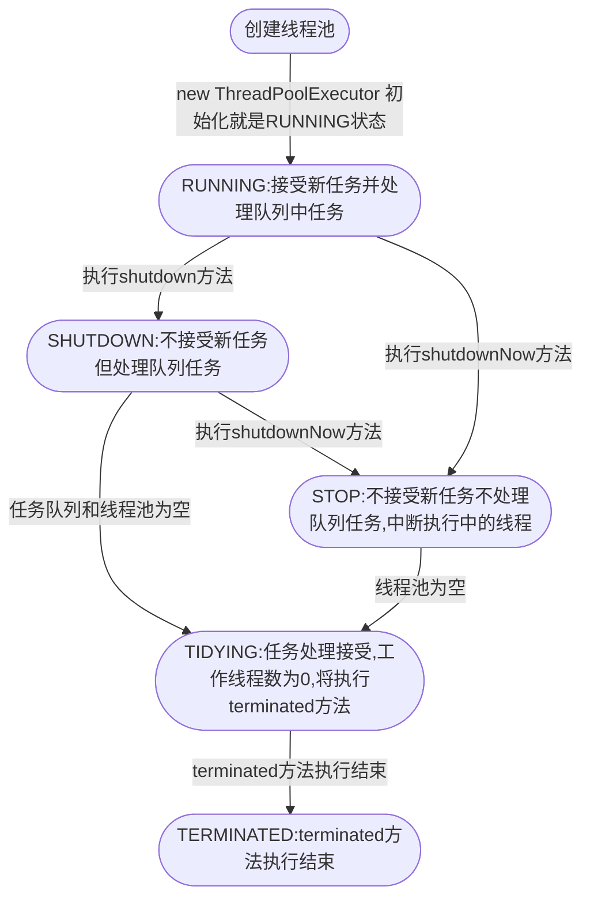

> 有关于线程池的源码分析

## 线程池状态

线程池有以下状态`RUNNING`、`SHUTDOWN`、`STOP`、`TIDYING`、`TERMINATED`，其定义如下。但在实际使用中，由于线程状态会因为池中线程数的影响发生改变。为了原子性控制这两个变量，因此使用`AtomicInteger`定义`ctl`，该对象是线程池状态与当前线程数或运算的结果，并通过`ctlOf(RUNNING, 0)`进行初始化。线程池也提供了一些用于操作`ctl`的方法。

```java
private static final int COUNT_BITS = Integer.SIZE - 3;
// 1fffffff 这个容量实际是线程的最大数。该值的有一个妙用是高位为ctl中线程状态和工作数的分界线。
private static final int CAPACITY = (1 << COUNT_BITS) - 1;

// -1 为32bit。左移29位结果为：0xe0000000
private static final int RUNNING    = -1 << COUNT_BITS;
// 值为0
private static final int SHUTDOWN   =  0 << COUNT_BITS;
// 值为0x20000000
private static final int STOP       =  1 << COUNT_BITS;
// 值为0x40000000
private static final int TIDYING    =  2 << COUNT_BITS;
// 值为0x60000000
private static final int TERMINATED =  3 << COUNT_BITS;


private static int runStateOf(int c) {
    // ctl与~CAPACITY，相当于截取高三位
    return c & ~CAPACITY;
}

private static int workerCountOf(int c) {
    // ctl与CAPACITY，相当于截取低29位
    return c & CAPACITY;
}

private static int ctlOf(int rs, int wc) {
    // rs线程池状态为高3位表示，wc工作数为低29位
    return rs | wc;
}

private static boolean runStateLessThan(int c, int s) {
    return c < s;
}

private static boolean runStateAtLeast(int c, int s) {
    return c >= s;
}

private static boolean isRunning(int c) {
    return c < SHUTDOWN;
}

// cas工作数自增1
private boolean compareAndIncrementWorkerCount(int expect) {
    return ctl.compareAndSet(expect, expect + 1);
}

// cas工作数自减1
private boolean compareAndDecrementWorkerCount(int expect) {
    return ctl.compareAndSet(expect, expect - 1);
}

// 不断重试直到工作数减1成功
private void decrementWorkerCount() {
    do {
    } while (!compareAndDecrementWorkerCount(ctl.get()));
}
```

- `ThreadPoolExecutor`提供了`runStateOf`方法用于从`ctl`中获取线程池状态；
- `workerCountOf`用于获取Worker对象数；
- `ctlOf`方法用于`ctl`的设置。
- `runStateLessThan`判断线程池当前状态在某个状态之前；
- `runStateAtLeast`判断线程池当前状态在某个状态或在某个状态之后；
- `isRunning`判断线程池是否为`RUNNING`；
- `compareAndIncrementWorkerCount`、`compareAndDecrementWorkerCount`、`decrementWorkerCount`通过cas原子性改变ctl的值。实质是改变`Worker`计数。

线程池状态的切换如下:



::: details 扩展

ctl用于记录线程池状态和`Worker`对象数。`Worker`实现了`Runnable`接口同时也是线程对象和`Runnable`任务的封装。线程的对向的创建通过线程工厂创建。并将当前对象作为`Runnable`参数。因此当`Worker`对象中的线程调用`start`方法的时候，实际是先调用的`Worker`对象中的run方法。类似静态代理的效果。

:::

## 线程池的初始化

线程池的初始化有很多构造方法，最全的参数为：

- `int corePoolSize`：核心线程数量
- `int maximumPoolSize`：最大线程数量。最大值收到`CAPACITY`限制
- `long keepAliveTime`：从队列中获取任务时，放弃等待任务可获取的时间。
- `TimeUnit unit`：keepAliveTime的时间单位。
- `BlockingQueue<Runnable> workQueue`：阻塞队列。
- `ThreadFactory threadFactory`：线程工厂，用于创建线程对象。
- `RejectedExecutionHandler handler`：任务拒绝策略。线程池数量最大时，需要根据策略拒绝接受新的任务。默认为`AbortPolicy`（通过抛出`RejectedExecutionException`异常来拒绝任务）

## execute

`execute`方法用于线程池中任务的执行，会执行如下步骤：

1. 判断当前线程数量是否超过了核心线程数。  
如果没有超过核心线程数，执行`addWorker`创建工作者（核心线程），将任务添加到核心线程。这里任务可能会立刻被执行
2. 如果核心线程数已经分配结束或者在第一步`addWorker`返回失败，则判断线程池状态是否正在运行。如果正在运行，将任务添加到队列中。  
在这个条件内部又进行了一次状态判断。  
如果不在运行状态，则移除任务，并执行拒绝策略。  
如果工作数量为0，则执行`addWorker`。消费队列中的任务。  
3. 如果线程不是在运行状态或者无法向队列中添加任务。  
如果当前的线程数量未达到最大线程数限制，则通过`addWorker`方法尝试执行线程。方法返回失败则执行拒绝策略。

这里我们需要明确两个概念：工作者Worker和任务Task。工作者几乎等同于线程池中的线程。task指的是Runnable的实现。需要注意最大线程数是固定的，线程的实例不一定是那几个。线程实例(工作者)通过`HashSet<Worker> workers`容器进行管理。

```java
public void execute(Runnable command) {
    if (command == null)
        throw new NullPointerException();
    int c = ctl.get();
    if (workerCountOf(c) < corePoolSize) {
        if (addWorker(command, true))
            return;
        // 执行完上述步骤，状态控制值可能发生改变。这里重新获取赋值。
        c = ctl.get();
    }
    if (isRunning(c) && workQueue.offer(command)) {
        int recheck = ctl.get();
        // 不是在运行状态就移除任务，移除成功执行拒绝策略。
        if (! isRunning(recheck) && remove(command))
            reject(command);
        // 如果是在运行状态或者移除失败，执行队列中的任务
        else if (workerCountOf(recheck) == 0)
            addWorker(null, false);
    }
    // 不是在运行状态或者任务队列无法添加任务，则尝试使用`addWorker`直接执行任务。
    // 如果执行失败则执行拒绝策略, 注意此处不是使用核心线程
    else if (!addWorker(command, false))
        reject(command);
}
```

## addWorker

这个方法有点长，但是可以分成两部分分析。`retry`所标记的for循环部分和创建`Worker`执行任务部分。

```java
private boolean addWorker(Runnable firstTask, boolean core) {
    retry:
    for (;;) {
        int c = ctl.get();
        int rs = runStateOf(c);

        // Check if queue empty only if necessary.
        if (rs >= SHUTDOWN &&
            ! (rs == SHUTDOWN &&
               firstTask == null &&
               ! workQueue.isEmpty()))
            return false;

        for (;;) {
            int wc = workerCountOf(c);
            if (wc >= CAPACITY ||
                wc >= (core ? corePoolSize : maximumPoolSize))
                return false;
            if (compareAndIncrementWorkerCount(c))
                break retry;
            c = ctl.get();  // Re-read ctl
            if (runStateOf(c) != rs)
                continue retry;
            // else CAS failed due to workerCount change; retry inner loop
        }
    }

    boolean workerStarted = false;
    boolean workerAdded = false;
    Worker w = null;
    try {
        w = new Worker(firstTask);
        final Thread t = w.thread;
        if (t != null) {
            final ReentrantLock mainLock = this.mainLock;
            mainLock.lock();
            try {
                // Recheck while holding lock.
                // Back out on ThreadFactory failure or if
                // shut down before lock acquired.
                int rs = runStateOf(ctl.get());

                if (rs < SHUTDOWN ||
                    (rs == SHUTDOWN && firstTask == null)) {
                    if (t.isAlive()) // precheck that t is startable
                        throw new IllegalThreadStateException();
                    workers.add(w);
                    int s = workers.size();
                    if (s > largestPoolSize)
                        largestPoolSize = s;
                    workerAdded = true;
                }
            } finally {
                mainLock.unlock();
            }
            if (workerAdded) {
                t.start();
                workerStarted = true;
            }
        }
    } finally {
        if (! workerStarted)
            addWorkerFailed(w);
    }
    return workerStarted;
}
```

在for循环中首先获取当前线程池的状态。根据状态决定是否进行工作者创建或任务的处理。

`rs >= SHUTDOWN && ! (rs == SHUTDOWN && firstTask == null && ! workQueue.isEmpty())`该条件比较绕，
但是可以转换为`(rs > SHUTDOWN) || (rs >= SHUTDOWN && firstTask != null)  || (rs >= SHUTDOWN && workQueue.isEmpty())`，
根据短路特性进一步可以简化为：`(rs > SHUTDOWN) || (rs == SHUTDOWN && firstTask != null)  || (rs == SHUTDOWN && workQueue.isEmpty())`。
这样一个比较复杂的条件就变成了3个。

因此可以理解为：

1. 如果线程池状态为`STOP`、`TIDYING`、`TERMINATED`，则无法执行该方法。
2. 如果线程池状态为`SHUTDOWN`，且新的任务存在，则无法执行该方法。
3. 如果线程池状态为`SHUTDOWN`，并且无新任务，且队列已经为空，则无法执行该方法。很明显没有任务了，怎么会继续执行下去。

因此如果线程池为`RUNNING`状态、`SHUTDOWN`状态但是任务队列非空。都可以进行工作者的创建或任务执行。（也要考虑到线程池状态发生改变的情况）

::: details 线程池容量上限是多少
在内部的for循环判断`wc >= CAPACITY || wc >= (core ? corePoolSize : maximumPoolSize)`，线程数是否超出了最大上限。（`CAPACITY`为0x1fffffff）
如果是向核心线程中添加，最大上限就是corePoolSize。一般而言 `corePoolSize < maximumPoolSize < CAPACITY`。
即使将`maximumPoolSize`设置为`Integer.MAX_VALUE`也是不起作用的。对于不限制容量的线程池，设置为`Integer.MAX_VALUE`只是方便理解。
:::

下面看一下内部循环中的逻辑：

- 如果线程数量超出了上限，则方法返回为false。
- 线程数量没有超出上限，通过cas的方式自增ctl。
- 如果自增失败，重新获取线程池状态并判断状态是否改变。如果状态改变则从retry标志处重新执行。线程池状态改变可能导致之前的校验不再满足。
- 如果状态没有改变则不断执行内部循环，直到自增成功，或者线程数量达到上限退出。

因此外部循环的关键在于获取线程池状态，看当前状态是否符合任务执行的条件。内部循环的重点在于在前者符合的情况下，尝试自增任务数；同时检测线程池状态是否发生改变，如果改变则从外层循环重新进入。

当ctl自增成功，那么开始创建工作者进行任务的执行。

1. 首先创建`Worker`对象，`Worker`实现了`Runnable`接口，同时也是线程对象和`Runnable`任务的封装。线程对像通过线程工厂`ThreadFactory`创建，工厂方法将当前`Worker`对象作为参数。因此当`Worker`对象中的线程调用`start`方法的时候，实际是先调用的`Worker`对象中的run方法。类似静态代理的效果。`Worker`对象创建时传入当前任务`firstTask`用于初始化。注意`firstTask`是有可能为空的。
2. 通过`ReetrantLock`加锁，保证一个时刻只添加一个work对象。
3. 如果当前的状态为`RUNNING`或者为`SHUTDOWN`但没有新的任务。那么将当前work加入到`works`容器中。（`HashSet<Worker> workers = new HashSet<>()`）
4. 如果`worker`对象加入到容器中成功。则开始线程的执行。
5. 如果某些原因导致添加失败。比如线程不可启动。此时执行`addWorkerFailed`方法，在该方法中首先将worker对象从容器中移除。之后通过cas工作计数减1。最后，执行`tryTerminate`，校验状态尝试终止。

## 线程执行

上面代码中`t.start()`就开始了线程的执行。run方法中调用了`runWorker`，下面分析下具体逻辑。

首先获取任务task，任务的来源可能是worker对象中维护的当前任务，也有可能是`workQueue`中的任务。（一个工作者创建之后，它就可以执行当前任务，如果没有当前任务指定了，它自觉地从任务队列中获取执行）
`beforeExecute` 与 `afterExecute`是线程池提供的默认方法, 不同的线程池实现可以重写该方法, 以实现在任务执行前后执行某些操作。
`task.run();`执行我们的任务，如果任务出现异常，这里是直接throw出去的。

```java
final void runWorker(Worker w) {
    Thread wt = Thread.currentThread();
    Runnable task = w.firstTask;
    w.firstTask = null;
    w.unlock(); // allow interrupts
    boolean completedAbruptly = true;
    try {
        while (task != null || (task = getTask()) != null) {
            w.lock();
            // If pool is stopping, ensure thread is interrupted;
            // if not, ensure thread is not interrupted.  This
            // requires a recheck in second case to deal with
            // shutdownNow race while clearing interrupt
            // 如果线程池停止, 线程池中的线程需要置为中断状态.
            // 如果线程池没有停止, 线程池中的线程不应被中断.
            if ((runStateAtLeast(ctl.get(), STOP) ||
                 (Thread.interrupted() &&
                  runStateAtLeast(ctl.get(), STOP))) &&
                !wt.isInterrupted())
                wt.interrupt();
            try {
                beforeExecute(wt, task);
                Throwable thrown = null;
                try {
                    task.run();
                } catch (RuntimeException x) {
                    thrown = x; throw x;
                } catch (Error x) {
                    thrown = x; throw x;
                } catch (Throwable x) {
                    thrown = x; throw new Error(x);
                } finally {
                    afterExecute(task, thrown);
                }
            } finally {
                task = null;
                w.completedTasks++;
                w.unlock();
            }
        }
        completedAbruptly = false;
    } finally {
        processWorkerExit(w, completedAbruptly);
    }
}

```

### processWorkerExit

当前任务执行结束后会调用`processWorkerExit`，如果你这样理解那就大错特错。其原因在于`getTask`中如果没有任务可以获取，工作者是直接等待的（使用ArrayBlockingQueue 等待时长根据我们的参数决定）。当我们调用`shutdown`方法时，状态改变，while的条件不再满足。此时会调用`processWorkerExit`，这个方法执行了，那么当前的工作者也就要gg了，可不是当前任务执行完了就执行，也不是没有任务就执行。


:::details completedAbruptly
什么叫做`completedAbruptly`啊，代码注释解释为由于用户异常导致任务停止，为啥呢？`completedAbruptly`默认值为true，如果没有任务可以执行那么会设置为false；如果有任务执行，但是任务出现异常，线程池是直接throw的，此时`completedAbruptly`值仍旧为true。
:::

```java
private void processWorkerExit(Worker w, boolean completedAbruptly) {
    // 如果是由于异常退出，由于之前累计了工作数，此时需要减少工作数。
    if (completedAbruptly) // If abrupt, then workerCount wasn't adjusted
        decrementWorkerCount();

    final ReentrantLock mainLock = this.mainLock;
    mainLock.lock();
    try {
        // 注意一个worker是可以复用的。也就是说它可以执行多个任务。
        completedTaskCount += w.completedTasks;
        // 从容器中移除当前工作者
        workers.remove(w);
    } finally {
        mainLock.unlock();
    }

    tryTerminate();

    int c = ctl.get();
    if (runStateLessThan(c, STOP)) {
        // 如果由于异常退出，那么尝试新增工作者执行任务
        // 正常结束，那么判断任务队列中是否还有任务没有执行。如果有则至少保留min个工作者，用于任务的执行。
        if (!completedAbruptly) {
            // 如果allowCoreThreadTimeOut为true，线程池中的核心线程清除掉后不会再创建新的工作者。
            // 如果为false则清除后判断如果线程数为核心线程数就不会再创建。
            int min = allowCoreThreadTimeOut ? 0 : corePoolSize;
            if (min == 0 && ! workQueue.isEmpty())
                min = 1;
            if (workerCountOf(c) >= min)
                return; // replacement not needed
        }
        addWorker(null, false);
    }
}
```

### getTask

`getTask`方法用于从任务队列中获取任务。这个功能通过队列的方法实现，此处不表。
我想说一下`timed`、`timedOut`的作用。这两个变量还控制了如果从队列中无法获取任务，线程池将自动清理线程任务数，直到线程数为0或者核心线程数。

- `timedOut`用于记录上一次从队列中获取是否超时。如果从队列中无法获取到任务则为true
- `timed`为`allowCoreThreadTimeOut || wc > corePoolSize`表示如果核心线程允许超时清除或者工作数超过核心线程数，则该标记为true。

注意：该方法只是减少工作数，当方法返回null后是由`processWorkerExit`进行工作者对象清理的。

```java
private Runnable getTask() {
    boolean timedOut = false; // Did the last poll() time out?

    for (;;) {
        int c = ctl.get();
        int rs = runStateOf(c);

        // Check if queue empty only if necessary.
        // 如果线程池停止，或者关闭时队列为空。那么减少工作数。进行退出处理
        if (rs >= SHUTDOWN && (rs >= STOP || workQueue.isEmpty())) {
            decrementWorkerCount();
            return null;
        }

        int wc = workerCountOf(c);

        // Are workers subject to culling?
        // 如果核心线程可以被清理那么最终线程池线程数为0
        boolean timed = allowCoreThreadTimeOut || wc > corePoolSize;

        // 如果工作数达到最大容量，超时并且任务数大于1或者超时时队列非空，减少工作数，
        // 此处使用continue，是一个反复清理过程。
        // 如果timedOut为true并且其他保持不变，allowCoreThreadTimeOut设置为true则会不断清理。
        // 设置为false则会保留核心线程。
        if ((wc > maximumPoolSize || (timed && timedOut))
            && (wc > 1 || workQueue.isEmpty())) {
            if (compareAndDecrementWorkerCount(c))
                return null;
            continue;
        }

        try {
            Runnable r = timed ?
                workQueue.poll(keepAliveTime, TimeUnit.NANOSECONDS) :
                workQueue.take();
            if (r != null)
                return r;
            timedOut = true;
        } catch (InterruptedException retry) {
            // 由于InterruptedException异常，会重新从队列中获取
            timedOut = false;
        }
    }
}

```

### tryTerminate

该方法的作用在于将线程池状态切换到终止（如果为SHUTDOWN且任务队列为空, STOP这两种情况）。同时方法内部对工作中的线程进行中断操作。

这个方法必须在任何可能导致线程池终止的情况下被调用，如：

- 减少worker数量
- shutdown时从queue中移除任务

```java
final void tryTerminate() {
    for (; ; ) {
        int c = ctl.get();
        // 如果为正在运行状态 或者线程池已经停止, 或者为SHUTDOWN但是任务队列非空
        // 以上三种情况不应该终止线程池
        if (isRunning(c) ||
                runStateAtLeast(c, TIDYING) ||
                (runStateOf(c) == SHUTDOWN && !workQueue.isEmpty()))
            return;
        
        // 如果为SHUTDOWN且任务队列为空, STOP这两种情况
        // 如果此时工作数非0，也就是仍有线程存活（有可能正在执行任务）。此时中断其中一个。
        if (workerCountOf(c) != 0) { // Eligible to terminate
            // ONLY_ONE为true 当工作数非0时 只中断一个线程(该线程从线程池中获取, 不一定是当前的)
            interruptIdleWorkers(ONLY_ONE);
            return;
        }

        // 进行线程池状态切换
        final ReentrantLock mainLock = this.mainLock;
        mainLock.lock();
        try {
            // 线程池状态切换到TIDYING状态
            if (ctl.compareAndSet(c, ctlOf(TIDYING, 0))) {
                try {
                    // 可以自定义实现，默认没有逻辑
                    terminated();
                } finally {
                    // 线程池状态切换到TERMINATED状态
                    ctl.set(ctlOf(TERMINATED, 0));
                    termination.signalAll();
                }
                return;
            }
        } finally {
            mainLock.unlock();
        }
        // else retry on failed CAS
    }
}
```

## 终止线程池

使用`shutdown`可以终止一个线程池。

```java
public void shutdown() {
    final ReentrantLock mainLock = this.mainLock;
    mainLock.lock();
    try {
        checkShutdownAccess();
        // 设置各个线程为SHUTDOWN状态
        advanceRunState(SHUTDOWN);
        // 中断所有线程，之前在tryTerminate已经提及过了
        interruptIdleWorkers();
        // 空方法 子类可以实现该方法
        onShutdown(); // hook for ScheduledLoggedThreadPoolExecutor
    } finally {
        mainLock.unlock();
    }
    // 终止线程池
    tryTerminate();
}
```

这里对tryTerminate方法进行一点补充，`termination.signalAll();`这个地方用于唤醒所有等待中的线程。顺着代码看下去可以看到`transferForSignal`这个方法。
`LockSupport.unpark(node.thread);`用于唤醒等待中的线程，还记得之前说`getTask`如果获取不到任务会进入等待状态吗？此时唤醒这些线程。`processWorkerExit`就可以被执行了，线程池就开始进行清理工作了。

```java
final boolean transferForSignal(Node node) {
    /*
        * If cannot change waitStatus, the node has been cancelled.
        */
    if (!compareAndSetWaitStatus(node, Node.CONDITION, 0))
        return false;

    /*
        * Splice onto queue and try to set waitStatus of predecessor to
        * indicate that thread is (probably) waiting. If cancelled or
        * attempt to set waitStatus fails, wake up to resync (in which
        * case the waitStatus can be transiently and harmlessly wrong).
        */
    Node p = enq(node);
    int ws = p.waitStatus;
    if (ws > 0 || !compareAndSetWaitStatus(p, ws, Node.SIGNAL))
        LockSupport.unpark(node.thread);
    return true;
}
```

### shutdownNow & shutdown

为什么我们不推荐用`shutdownNow`呢？

```java
public List<Runnable> shutdownNow() {
    List<Runnable> tasks;
    final ReentrantLock mainLock = this.mainLock;
    mainLock.lock();
    try {
        checkShutdownAccess();
        advanceRunState(STOP);
        interruptWorkers();
        tasks = drainQueue();
    } finally {
        mainLock.unlock();
    }
    tryTerminate();
    return tasks;
}
```

对比一下两个方法，有以下几点区别。

1. shutdownNow是将线程池置为`STOP`状态，shutdown方法置为`SHUTDOWN`状态。STOP状态无法执行队列中的任务，而后者可以。
2. shutdownNow方法使用`drainQueue`移除任务队列。
3. shutdown方法返回为void；shutdownNow返回任务队列。
4. shutdown提供了钩子方法供子类实现。这个是个小区别。
